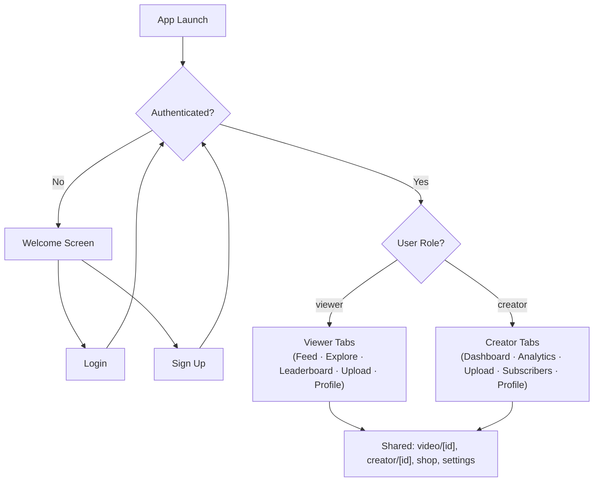

<![CDATA[# 💎 GemSpot — Discover YouTube's Hidden Gems

> **A community-driven platform for discovering, upvoting, and celebrating underrated YouTube creators.**

GemSpot is a cross-platform mobile application built with **React Native (Expo)** and **Firebase** that connects viewers with small YouTube creators (under 50K subscribers). Viewers discover and upvote hidden-gem videos, while creators gain exposure through community-powered leaderboards — no algorithm required.

---

## 📋 Table of Contents

- [Features](#-features)
- [Tech Stack](#-tech-stack)
- [Architecture](#-architecture)
- [Project Structure](#-project-structure)
- [Getting Started](#-getting-started)
- [Environment Variables](#-environment-variables)
- [Firebase Setup](#-firebase-setup)
- [Available Scripts](#️-available-scripts)
- [Database Schema](#-database-schema)
- [Contributing](#-contributing)
- [License](#-license)

---

## ✨ Features

### 👀 For Viewers
| Feature | Description |
|---------|-------------|
| **Video Feed** | Browse a curated feed of under-the-radar YouTube content, filterable by category and subscriber range |
| **Explore & Search** | Discover creators and videos across 12 categories (Gaming, Tech, Music, Education, etc.) |
| **Upvote System** | Cast daily votes for your favourite gems — limited votes per day encourages curation |
| **Leaderboard** | See which creators are rising based on community votes, views, and engagement |
| **Comments** | Discuss videos and engage with the community |
| **Follow Creators** | Subscribe to your favourites and track their journey |
| **Streaks & Badges** | Earn badges and maintain daily activity streaks for engagement rewards |
| **Submit Gems** | Discover a small creator? Submit their video for the community to vote on |

### 🎬 For Creators
| Feature | Description |
|---------|-------------|
| **Creator Dashboard** | Dedicated home screen with video management and performance overview |
| **Analytics** | Track views, votes, comments, and growth across all submitted videos |
| **Upload Videos** | Submit your own YouTube content directly to the platform |
| **Subscriber Insights** | Monitor your GemSpot follower base and engagement metrics |
| **Brand Deals** | Browse and apply to brand campaigns seeking small creators |
| **Profile Claiming** | Claim your auto-created creator profile and link it to your GemSpot account |
| **Stat Cards** | At-a-glance metrics: total views, votes, comments, and subscriber count |

### 🛒 Creator Shop
A built-in affiliate shop featuring curated creator gear — microphones, cameras, lighting, tripods, editing tools, and starter kits.

### 🔐 Authentication
- Email/password sign-up with role selection (Viewer / Creator / Brand)
- YouTube channel URL linking for creators
- Persistent sessions via AsyncStorage
- Auth-gated routing with role-based redirection

---

## 🛠 Tech Stack

| Layer | Technology |
|-------|-----------|
| **Framework** | [Expo](https://expo.dev) (SDK 54) with [Expo Router](https://docs.expo.dev/router/introduction/) (file-based routing) |
| **Language** | TypeScript |
| **UI** | React Native 0.81 with React 19 |
| **Navigation** | Expo Router + React Navigation (Bottom Tabs, Stack) |
| **Backend** | [Firebase](https://firebase.google.com) (Authentication, Cloud Firestore, Cloud Storage) |
| **Video** | YouTube Data API v3 + `react-native-youtube-iframe` |
| **State Management** | React Context API (AuthContext, ThemeContext) |
| **Styling** | Custom design system (`constants/theme.ts`) with Inter font family |
| **Animations** | `react-native-reanimated` + haptic feedback (`expo-haptics`) |
| **Image Handling** | `expo-image` (optimised caching) + `expo-image-picker` |
| **Persistence** | `@react-native-async-storage/async-storage` |

---

## 🏗 Architecture

### High-Level Overview

```
┌──────────────────────────────────────────────────────────┐
│                     Expo Router                          │
│               (File-based Navigation)                    │
├──────────────┬───────────────┬───────────────────────────┤
│  Auth Screens│  Viewer Tabs  │  Creator Tabs             │
│  (login,     │  (feed,       │  (dashboard,              │
│   signup,    │   explore,    │   analytics,              │
│   welcome)   │   leaderboard,│   upload,                 │
│              │   upload,     │   subscribers,             │
│              │   profile)    │   profile)                 │
├──────────────┴───────────────┴───────────────────────────┤
│                    Shared Screens                         │
│          (video/[id], creator/[id], shop,                │
│           brand-deals, settings)                         │
├──────────────────────────────────────────────────────────┤
│                    Components Layer                       │
│   (VideoCard, CreatorCard, ProductCard, SearchBar,       │
│    StatCard, CategoryChip, SkeletonLoader, etc.)         │
├──────────────────────────────────────────────────────────┤
│                   Context Providers                       │
│             AuthContext  ·  ThemeContext                  │
├──────────────────────────────────────────────────────────┤
│                    Services Layer                         │
│   auth · user · video · creator · comment · badge ·      │
│   ranking · subscribe · creator-stats · youtube ·        │
│   storage · firebase                                     │
├──────────────────────────────────────────────────────────┤
│                  Firebase (Backend)                       │
│       Auth  ·  Firestore  ·  Cloud Storage               │
└──────────────────────────────────────────────────────────┘
```

### Navigation Flow



### Key Design Decisions

- **Role-based tab navigation** — Creators and viewers get entirely separate tab layouts, each tailored to their workflow
- **Service-layer abstraction** — All Firebase calls are isolated in `/services`, keeping screens thin and testable
- **Design system** — Centralised tokens in `constants/theme.ts` (colours, spacing, typography, shadows, animations) ensure visual consistency
- **Denormalized data** — Creator name/avatar are stored alongside videos for fast reads without extra lookups
- **YouTube API integration** — Video metadata and thumbnails are auto-fetched when a YouTube URL is submitted

---

## 📁 Project Structure

```
gemSpot/
├── app/                          # 📱 Screens (Expo Router file-based routing)
│   ├── _layout.tsx               #   Root layout — auth gate, font loading, providers
│   ├── welcome.tsx               #   Onboarding / welcome screen
│   ├── settings.tsx              #   App settings (theme, account, etc.)
│   ├── brand-deals.tsx           #   Brand campaign marketplace
│   ├── shop.tsx                  #   Creator gear affiliate shop
│   │
│   ├── auth/                     #   🔐 Authentication screens
│   │   ├── login.tsx             #     Email/password login
│   │   └── signup.tsx            #     Registration with role selection
│   │
│   ├── (tabs)/                   #   👀 Viewer tab group
│   │   ├── _layout.tsx           #     Tab bar layout
│   │   ├── index.tsx             #     Home feed (videos)
│   │   ├── explore.tsx           #     Explore creators & categories
│   │   ├── leaderboard.tsx       #     Community leaderboard
│   │   ├── upload.tsx            #     Submit a gem (YouTube URL)
│   │   └── profile.tsx           #     Viewer profile & stats
│   │
│   ├── (creator-tabs)/           #   🎬 Creator tab group
│   │   ├── _layout.tsx           #     Creator tab bar layout
│   │   ├── index.tsx             #     Creator dashboard
│   │   ├── analytics.tsx         #     Video analytics & metrics
│   │   ├── upload.tsx            #     Upload own content
│   │   ├── subscribers.tsx       #     Follower management
│   │   └── profile.tsx           #     Creator profile & settings
│   │
│   ├── video/
│   │   └── [id].tsx              #     Video detail & player screen
│   │
│   └── creator/
│       └── [id].tsx              #     Creator profile detail screen
│
├── components/                   # 🧩 Reusable UI components
│   ├── video-card.tsx            #   Video thumbnail card with vote button
│   ├── creator-card.tsx          #   Creator profile card
│   ├── product-card.tsx          #   Shop product card
│   ├── campaign-card.tsx         #   Brand deal campaign card
│   ├── stat-card.tsx             #   Metrics display card
│   ├── category-chip.tsx         #   Category filter chip
│   ├── search-bar.tsx            #   Search input component
│   ├── section-header.tsx        #   Section title with "See All"
│   ├── skeleton-loader.tsx       #   Loading placeholder animation
│   ├── empty-state.tsx           #   Empty list fallback UI
│   ├── unclaimed-badge.tsx       #   Badge for unclaimed creator profiles
│   ├── custom-tab-bar.tsx        #   Viewer bottom tab bar (glassmorphism)
│   ├── creator-tab-bar.tsx       #   Creator bottom tab bar
│   ├── parallax-scroll-view.tsx  #   Parallax header scroll view
│   ├── themed-text.tsx           #   Theme-aware text component
│   ├── themed-view.tsx           #   Theme-aware view component
│   ├── haptic-tab.tsx            #   Tab button with haptic feedback
│   ├── hello-wave.tsx            #   Animated wave emoji
│   ├── external-link.tsx         #   Opens URLs in external browser
│   └── ui/                       #   Low-level UI primitives
│
├── contexts/                     # 🔄 React Context providers
│   ├── auth-context.tsx          #   Authentication state & methods
│   └── theme-context.tsx         #   Dark/light mode state
│
├── services/                     # 🔌 Firebase service layer
│   ├── firebase.ts               #   Firebase app initialisation
│   ├── auth-service.ts           #   Sign in, sign up, profile fetch
│   ├── user-service.ts           #   User profile CRUD, streak tracking
│   ├── video-service.ts          #   Video CRUD, voting, feed queries
│   ├── creator-service.ts        #   Creator profiles, claiming
│   ├── creator-stats-service.ts  #   Aggregated creator analytics
│   ├── comment-service.ts        #   Comment CRUD
│   ├── badge-service.ts          #   Badge definitions & awarding
│   ├── ranking-service.ts        #   Leaderboard ranking logic
│   ├── subscribe-service.ts      #   Follow/unfollow relationships
│   ├── storage-service.ts        #   Firebase Cloud Storage uploads
│   └── youtube-service.ts        #   YouTube Data API v3 integration
│
├── constants/                    # 📐 App-wide constants
│   ├── theme.ts                  #   Design tokens (colours, spacing, typography, shadows)
│   ├── types.ts                  #   TypeScript interfaces & enums
│   └── mock-data.ts              #   Mock data for development
│
├── hooks/                        # 🪝 Custom React hooks
│   ├── use-color-scheme.ts       #   Native colour scheme detection
│   ├── use-color-scheme.web.ts   #   Web colour scheme detection
│   └── use-theme-color.ts       #   Theme-aware colour resolver
│
├── assets/                       # 🖼 Static assets
│   └── images/                   #   App icons, splash screens, favicons
│
├── scripts/                      # 🔧 Utility scripts
│   └── reset-project.js          #   Reset to blank project template
│
├── .env.example                  # 🔑 Environment variable template
├── FIREBASE_SCHEMA.md            # 📊 Full Firestore schema documentation
├── app.json                      # ⚙️ Expo configuration
├── package.json                  # 📦 Dependencies & scripts
├── tsconfig.json                 # 🔷 TypeScript configuration
├── eslint.config.js              # 🧹 ESLint configuration
└── .gitignore                    # 🚫 Git ignore rules
```

---

## 🚀 Getting Started

### Prerequisites

| Requirement | Version |
|-------------|---------|
| **Node.js** | 18+ |
| **npm** | 9+ |
| **Expo CLI** | Latest (installed automatically via `npx`) |
| **Firebase Project** | With Auth, Firestore, and Storage enabled |
| **YouTube Data API v3 Key** | From Google Cloud Console |

### Installation

1. **Clone the repository**
   ```bash
   git clone https://github.com/your-username/gemSpot.git
   cd gemSpot
   ```

2. **Install dependencies**
   ```bash
   npm install
   ```

3. **Set up environment variables**
   ```bash
   cp .env.example .env
   ```
   Fill in your Firebase and YouTube API credentials (see [Environment Variables](#-environment-variables)).

4. **Start the development server**
   ```bash
   npx expo start
   ```

5. **Open the app**

   You'll see options to open the app in:
   - 📱 **Expo Go** — Scan the QR code with the Expo Go app ([iOS](https://apps.apple.com/app/expo-go/id982107779) / [Android](https://play.google.com/store/apps/details?id=host.exp.exponent))
   - 🤖 **Android Emulator** — Press `a` (requires [Android Studio](https://docs.expo.dev/workflow/android-studio-emulator/))
   - 🍎 **iOS Simulator** — Press `i` (macOS only, requires [Xcode](https://docs.expo.dev/workflow/ios-simulator/))
   - 🌐 **Web Browser** — Press `w`

---

## 🔑 Environment Variables

Create a `.env` file in the project root (use `.env.example` as a template):

```env
# ─── Firebase Configuration ───
# Get from: Firebase Console → Project Settings → General → Your apps → Web app
EXPO_PUBLIC_FIREBASE_API_KEY=your_firebase_api_key
EXPO_PUBLIC_FIREBASE_AUTH_DOMAIN=your_project_id.firebaseapp.com
EXPO_PUBLIC_FIREBASE_PROJECT_ID=your_project_id
EXPO_PUBLIC_FIREBASE_STORAGE_BUCKET=your_project_id.firebasestorage.app
EXPO_PUBLIC_FIREBASE_MESSAGING_SENDER_ID=your_sender_id
EXPO_PUBLIC_FIREBASE_APP_ID=your_app_id

# ─── YouTube Data API v3 ───
# Get from: Google Cloud Console → APIs & Services → Credentials → Create API Key
# Enable "YouTube Data API v3" in the API Library
EXPO_PUBLIC_YOUTUBE_API_KEY=your_youtube_api_key
```

> **Note:** Firebase client API keys are *not* secret — security is enforced by Firestore Security Rules. See [`FIREBASE_SCHEMA.md`](./FIREBASE_SCHEMA.md) for full details.

---

## 🔥 Firebase Setup

### For New Developers (Joining an Existing Project)

1. Clone the repo
2. Copy `.env.example` → `.env`
3. Ask the project owner for the Firebase credentials
4. Run `npm install && npx expo start`

### For Project Owners (Setting Up From Scratch)

1. Go to [Firebase Console](https://console.firebase.google.com/) and create a new project
2. **Authentication** → Enable **Email/Password** sign-in provider
3. **Firestore** → Create database in production mode
4. **Storage** → Enable Cloud Storage
5. Copy the web app credentials into your `.env` file
6. Paste the Firestore Security Rules from [`FIREBASE_SCHEMA.md`](./FIREBASE_SCHEMA.md)
7. Create the required composite indexes:

   | Collection | Fields | Order |
   |------------|--------|-------|
   | `videos` | `creatorId` + `createdAt` | ASC + DESC |
   | `videos` | `submittedBy` + `createdAt` | ASC + DESC |
   | `videos` | `category` + `createdAt` | ASC + DESC |
   | `comments` | `videoId` + `createdAt` | ASC + DESC |

---

## ⚙️ Available Scripts

| Command | Description |
|---------|-------------|
| `npm start` | Start the Expo development server |
| `npm run android` | Start on Android emulator |
| `npm run ios` | Start on iOS simulator |
| `npm run web` | Start in web browser |
| `npm run lint` | Run ESLint |
| `npm run reset-project` | Reset to a blank project (moves starter code to `app-example/`) |

---

## 💾 Database Schema

GemSpot uses **Cloud Firestore** with the following collections:

```
Firestore
├── users/              # User profiles (doc ID = Auth UID)
│   └── {userId}        # name, email, role, streak, badges, followers, etc.
│
├── videos/             # Submitted videos (auto-generated doc IDs)
│   └── {videoId}       # title, youtubeUrl, category, voteCount, voters[], etc.
│       └── comments/   # Subcollection of comments
│           └── {commentId}
│
├── creators/           # YouTube creator profiles (claimed or unclaimed)
│   └── {creatorId}     # channelId, subscriberCount, totalVotes, rank, etc.
│
├── creatorStats/       # Aggregated analytics per creator
│   └── {userId}        # totalViews, totalLikes, totalComments, etc.
│
└── follows/            # Follow relationships (doc ID = followerId__followingId)
    └── {followId}      # followerId, followingId, createdAt
```

### Entity Relationships

```
┌──────────┐       ┌──────────┐       ┌──────────┐
│  users   │──1:N──│  videos  │──1:N──│ comments │
│          │       │          │       │          │
│ id (uid) │       │ id       │       │ id       │
│ name     │       │ title    │       │ videoId  │
│ role     │       │ creator* │       │ userId   │
│ followers│       │ votes    │       │ text     │
│ badges[] │       │ views    │       │ likes    │
└──────────┘       └──────────┘       └──────────┘
     │                   │
     │              ┌────┘
     │              ▼
     │         ┌──────────┐
     │         │ creators │
     │         │          │
     │         │ id       │
     │         │ name     │
     │         │ claimed  │
     │         │ userId?  │
     │         └──────────┘
     │
     ▼
┌──────────┐
│ follows  │
│          │
│ follower │
│ following│
└──────────┘
```

> 📖 For the full schema with all fields, types, security rules, and indexes, see [`FIREBASE_SCHEMA.md`](./FIREBASE_SCHEMA.md).

---

## 🤝 Contributing

1. **Fork** the repository
2. **Create** a feature branch (`git checkout -b feature/amazing-feature`)
3. **Commit** your changes (`git commit -m 'Add amazing feature'`)
4. **Push** to the branch (`git push origin feature/amazing-feature`)
5. **Open** a Pull Request

### Code Style

- TypeScript strict mode
- ESLint for linting (`npm run lint`)
- Use the design system tokens from `constants/theme.ts` — avoid hardcoded colours and spacing
- Keep screens thin — business logic belongs in `/services`
- Follow the existing naming conventions (`kebab-case` for files, `PascalCase` for components)

---

## 📄 License

This project is private and not currently licensed for public distribution.

---

<p align="center">
  Made with 💜 by the GemSpot team
</p>
]]>
